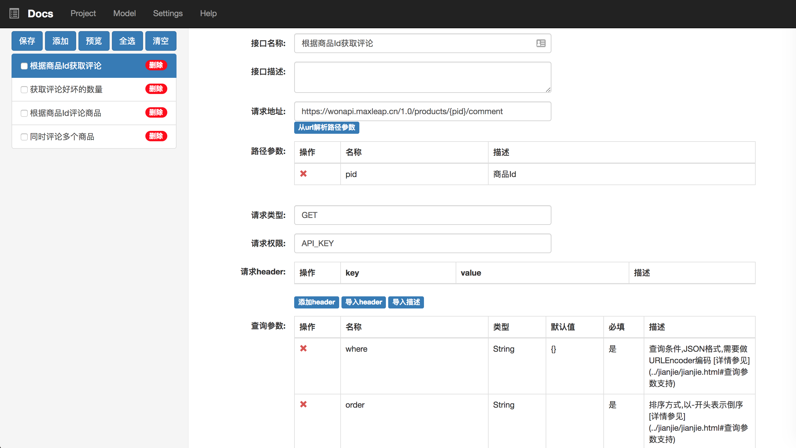

# api-docs

api-docs 是一个restapi 文档系统。可帮助程序员快编写 和 更新文档。 并可以自动生成markdown 文档  并支持自定格式  

> 后期考虑可以和RAP进行对接




### 启动方式

server

 运行  Bootstrap

html 

```shell
cd www 
npm install 
npm start
```

依赖 mongo 数据库  请在config/dev/config 修改mongo 配置   redis配置不是必须

推荐docker 安装mongo  https://hub.docker.com/_/mongo/

**后面加入docker 运行**


